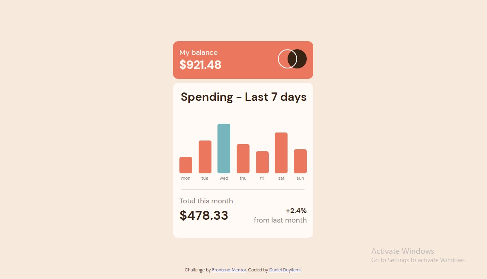
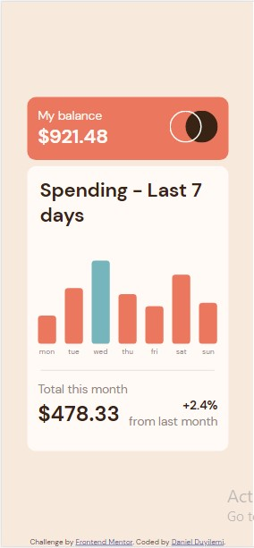

# Frontend Mentor - Expenses chart component solution

This is a solution to the [Expenses chart component challenge on Frontend Mentor](https://www.frontendmentor.io/challenges/expenses-chart-component-e7yJBUdjwt). Frontend Mentor challenges help you improve your coding skills by building realistic projects.

## Table of contents

- [Overview](#overview)
  - [The challenge](#the-challenge)
  - [Screenshot](#screenshot)
  - [Links](#links)
- [My process](#my-process)
  - [Built with](#built-with)
  - [What I learned](#what-i-learned)
  - [Continued development](#continued-development)
  - [Useful resources](#useful-resources)
- [Author](#author)
- [Acknowledgments](#acknowledgments)

## Overview

### The challenge

Users should be able to:

- View the bar chart and hover over the individual bars to see the correct amounts for each day
- See the current day’s bar highlighted in a different colour to the other bars
- View the optimal layout for the content depending on their device’s screen size
- See hover states for all interactive elements on the page
- **Bonus**: Use the JSON data file provided to dynamically size the bars on the chart

### Screenshot

### Links

- Solution URL: [https://github.com/Catalyst497/Expenses-Chart-component.git]
- Live Site URL: [https://catalyst497.github.io/Expenses-Chart-component/]

### Built with

- Semantic HTML5 markup
- Flexbox
- SASS

### What I learned

The project helped sharpen my skills a little bit with API. It was fun.

## Author

- Website - [Daniel Duyilemi](http://vast-falls-30673.herokuapp.com/)
- Frontend Mentor - [@Catalyst497](https://www.frontendmentor.io/profile/Catalyst497)
- GitHub - [@Catalyst497](https://github.com/Catalyst497)
- Twitter - [@Catalyst497](https://twitter.com/Catalyst497)

## Acknowledgments

Thank you Frontend mentor for this project. It was a wonderful one.
